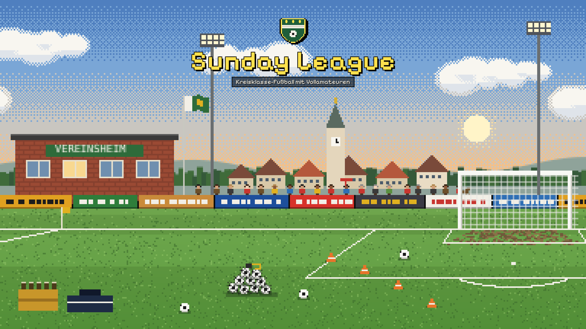
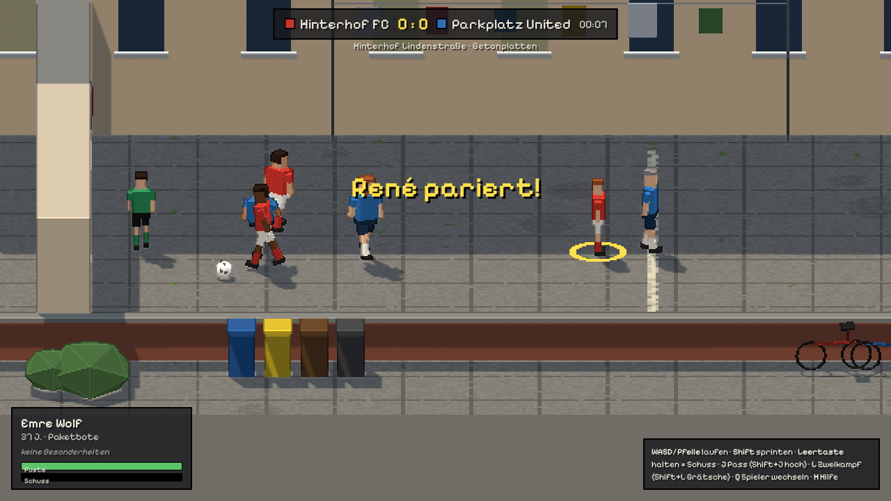
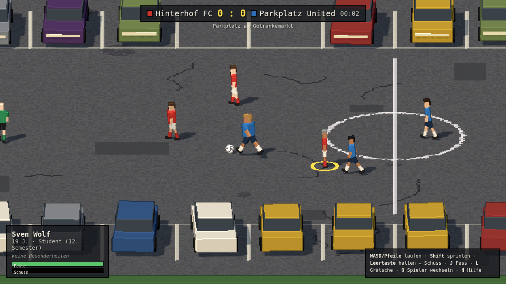
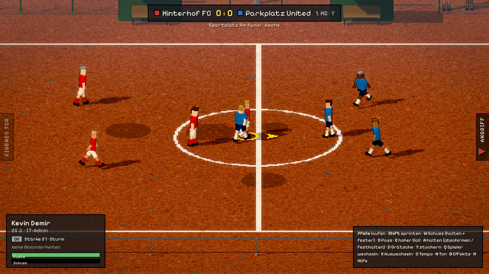
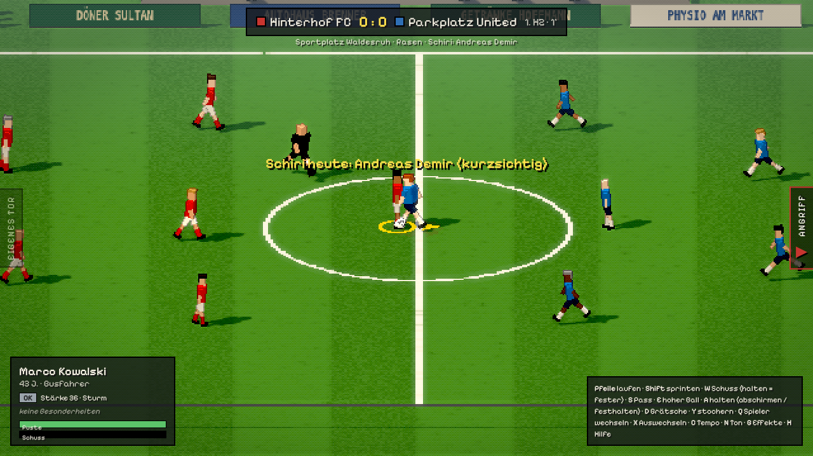
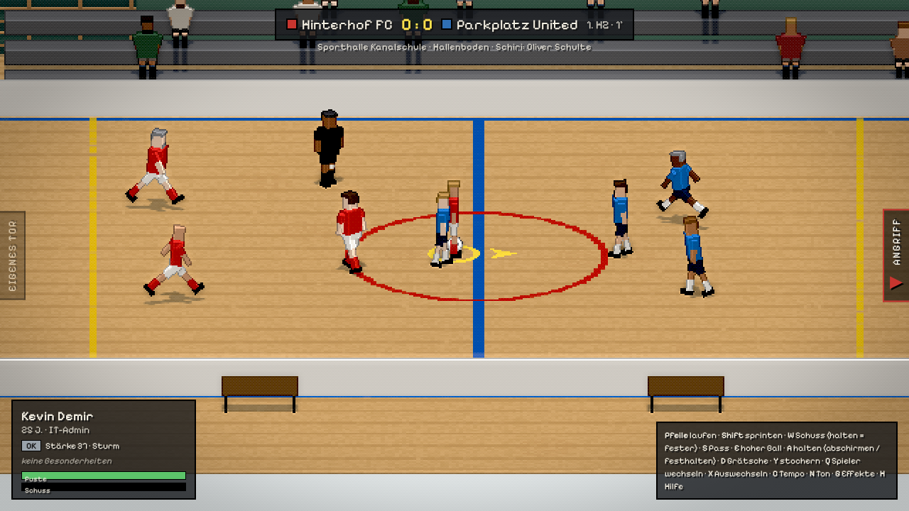
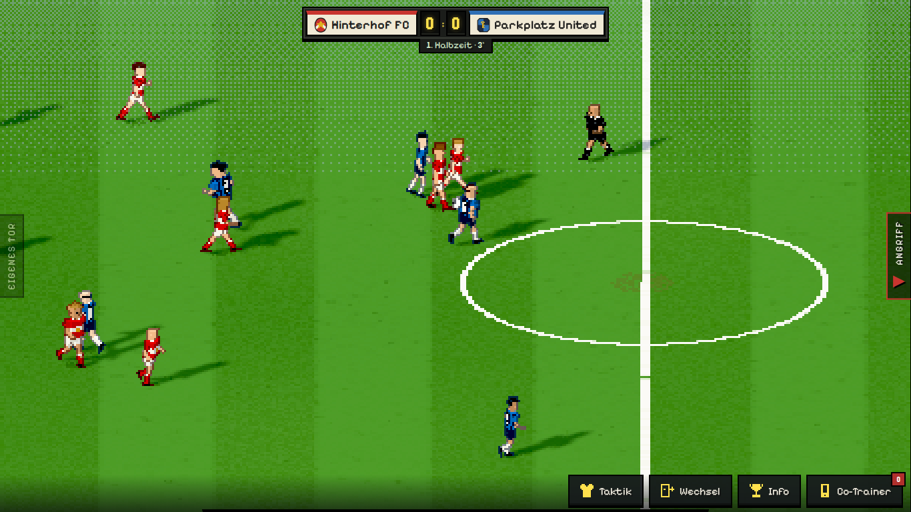
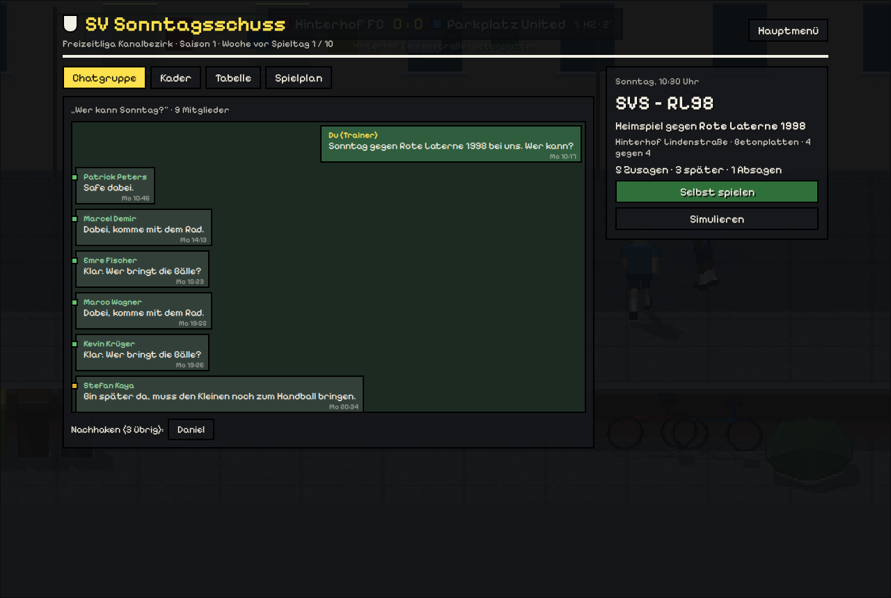
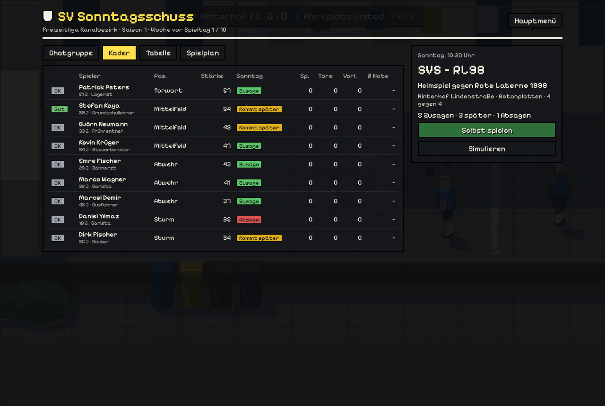

# Sunday League

**Grassroots football with proper amateurs – from the backyard to the regional league.**

🇩🇪 **[Deutsche Version → README.md](README.md)**

A football and club-management game about the beautiful game as it is really played:
Sunday, 10:30, drizzle, seven spectators, two of them dogs.

[](https://github.com/MrPavian/sunday-league/actions/workflows/ci.yml)




---

## Play now

**In the browser:** **<https://mrpavian.github.io/sunday-league/>** – on PC with keyboard or gamepad, on a phone as
the manager on the touchline. Your save lives in the browser (export/import under *Saves*).

**On Android (APK):** **[Download sunday-league.apk](https://github.com/MrPavian/sunday-league/releases/latest/download/sunday-league.apk)**
(always the latest version, see [Releases](https://github.com/MrPavian/sunday-league/releases)). Copy it to your phone,
open it and allow "unknown sources" for your browser or file manager. It is a debug build without a Play Store
signature; the game needs no permissions and no internet. Every push to `main` also builds an APK in the
"Android" workflow (Actions → Android → Artifacts).
Alternatively open the browser version in Chrome and choose "Add to home screen" – it then runs like an app, offline too.

The game starts in German; pick **English** on first start or any time in the settings (key **O**).

```bash
git clone https://github.com/MrPavian/sunday-league.git
cd sunday-league
npm install
npm run dev           # http://localhost:5173
npm run android:apk   # build the Android APK (needs Java 21 and the Android SDK)
```

Requires Node.js 20 or newer.

---

## What is it about?

You are the **player-manager** of SV Sonntagsschuss in the Kanalbezirk recreational league. Your squad is made of
parcel couriers, dentists, apprentices and early retirees. Every week the group chat asks "Who can make Sunday?",
and the answers depend on life: shift work, a sick kid, a job out of town, a hangover from a stag do.

You play the match yourself – side-on, with real ball feel, misplaced passes and air shots – manage it from the
touchline, or follow it as a live ticker. In between you run the club: money, sponsors, recruiting, youth teams,
the clubhouse. And at some point the knees creak and the next generation takes over.

**The tone:** warm with dry humour. The game never laughs at its characters – the comedy comes from everyday life.

---

## Features

### On the pitch
- **Three ways to experience a match:** play it yourself, coach from the touchline (shouts, subs, a situation
  engine that reads the game and offers three big choices), or a live ticker with decisions
- **Eight venues with their own physics:** paving slabs, tarmac, park grass, cinders, grass and a sports hall –
  from 4 v 4 in the backyard via 7- and 9-a-side up to **11 v 11 on a full-size pitch (105 × 68 m) with offside**
- **Tactics per format:** e.g. 2-3-1 on 7-a-side, 3-3-2 on 9-a-side, 4-4-2, 4-3-3, 4-2-3-1 or 3-5-2 on the big
  pitch, plus seven playing styles. Players keep their shape, the block shifts with the ball, defending is zonal
- **Attacking ideas:** one-twos, lay-offs with the back to goal, holding the ball up, through balls, shots from
  good positions; keepers punch high balls clear
- **Offside** only on the full-size pitch: what counts is the position at the pass; none from throw-ins, goal
  kicks and corners – and without linesmen the referee misses one now and then
- **Set pieces you shape yourself:** free kicks with a wall, corners short or to either post, penalties and shoot-outs
- **Weather with consequences:** heat drains stamina, rain lengthens slide tackles, wind blows crosses off course,
  frost hardens the ground, snow stops the ball
- **Incidents:** a dog steals the ball, the sprinkler comes on, the police arrive about the noise
- **Substitutions by league rules:** rolling subs in the rec league, four in the district leagues, five in the
  Bezirksliga – no re-entry

### Career & club
- **Five leagues with play-offs:** recreational league, Kreisklasse C and B (7 v 7), Kreisliga A (9 v 9) and
  Bezirksliga (11 v 11). Higher up there is gate money, bigger crowds and sponsors – and expenses for good
  players (at most €250 a month, as the German FA allows for amateurs)
- **Fitness:** 50–100 % per player; tired players start with less stamina and get injured more easily.
  Auto-pick looks at strength in position, form and fitness
- **Recruiting as a conversation:** every candidate has two motives (playing time, mates, success, the third half,
  training times, money, no fuss). Watching and asking around reveal them; in the talk the right arguments count.
  Rumours stay on the board for 2–4 weeks, promises must be kept
- **Poaching:** other clubs – often the derby rival – go after your bench-warmers and stars. And very rarely one
  signs a professional contract: the pro club then pays training compensation
- **A youth section with depth** from U11 to U19: a coach and a training focus per team (with a coaching licence
  course), early and late developers, school stress and different kinds of parents, weekly youth fixtures with a
  table, football festivals for the U11s, a Whitsun tournament, the regional DFB training centre, moves to pro
  academies with training compensation according to the German FA youth rules – and the bridge to the first team:
  training with the seniors and mentors
- **The group chat lives:** answers change team chemistry, form and reliability; every decision shows its consequences
- **The club remembers:** players who leave in a row turn up at rivals and score "of all people" against you;
  bogey teams, opposing managers in the local paper, handshakes or brawls after the final whistle
- **Club life:** annual general meeting, supporters' association, treasurer audit, neighbours, flea market,
  training camp and Christmas party; a fines list (air shot €1, own goal buys a round)
- **Sponsors with quirks**, over 100 jobs with perks, shirts and a crest editor, an expandable clubhouse
- **Club museum, season targets and a season review** as a special issue of the local paper
- **Across generations:** at 40 the question of hanging up the boots, at 50 you only coach, and eventually you
  hand over – to your own child, your assistant, the captain or a club legend

---

## Screenshots

| Backyard | Car park | Cinder pitch |
|---|---|---|
|  |  |  |

| Grass pitch | Sports hall | Kreisliga A (9 v 9) |
|---|---|---|
|  |  |  |

| Clubhouse | Squad |
|---|---|
|  |  |

---

## Venues

| Venue | Format | Surface | Notes |
|---|---|---|---|
| Lindenstraße backyard | 4 v 4 | paving slabs | garage door vs. chalk goal, house walls as boards |
| Drinks market car park | 5 v 5 | tarmac | jumpers for goalposts, "hit a car" rule |
| Kastanienallee park | 5 v 5 | park grass | rucksack goals, throw-ins at the imaginary line |
| Am Kanal ground | 5 v 5 | cinders | youth goals with posts and bar, corners, goal kicks |
| Waldesruh ground | 7 v 7 | grass | referee, local sponsors' boards (Kreisklasse C and B) |
| Kanalwiese sports ground | 9 v 9 | grass | 70 × 50 m, 5 × 2 m goals, penalties from 8 m (Kreisliga A) |
| Canal Stadium | 11 v 11 | grass | full-size 105 × 68 m, offside, five subs (Bezirksliga) |
| Kanalschule sports hall | 5 v 5 | parquet | boards, handball goals, indoor tournament in winter |

---

## Controls

Right hand runs, left hand plays.

| Action | Keyboard | Gamepad |
|---|---|---|
| Run | arrow keys | left stick |
| Sprint | Shift | RB / RT |
| Shoot (hold = harder) | W | X |
| Low pass | S | A |
| High ball / cross | E | B |
| Hold: shield the ball, or grab an opponent (foul risk!) | A | LT |
| Slide tackle | D | Y |
| Poke (standing tackle) | Z | R3 |
| Switch player | Q | LB |
| Substitutions board | X | Back |
| Help on/off | H | – |
| Sound on/off | N | – |
| Graphics effects on/off | G | – |
| Screenshot (PNG) | F2 | – |
| Settings | O | – |

In the menu: **K** career, **C** challenges, **P** player pool, **L** saves (3 slots, export/import), **O** settings.

---

## Development

```bash
npm run dev      # dev server with hot reload
npm test         # 459 tests (simulation and career)
npm run e2e      # browser checks with Playwright (menus, match, career, graphics)
npm run longrun -- 10 77 --bot  # ten seasons as an active bot manager, money broken down per league
node scripts/engine.mjs 30 240  # measure the match engine per venue
npm run build    # production build to dist/
```

The match simulation (`src/sim/`) is deterministic and independent of three.js; the renderer (`src/render/`)
draws the scene at low resolution and upscales it pixel-perfectly, with a post-processing shader for outlines
from depth and normals, contact shadows, glow, colour grading per weather, haze, snow cover and Bayer dithering.
Sound is synthesised with Web Audio – there are no audio files. The Android app wraps the same build with Capacitor.

More (in German): **[project overview](docs/OVERVIEW.md)** and **[roadmap](ROADMAP.md)**.

---

## Status

Playable prototype: the match from 4 v 4 to 11 v 11, a full career across five leagues with play-offs, and the club,
youth and life systems are done. Fully playable in German and English, in the browser and as an Android APK.
Still open: a desktop build and a signed store version.

## Contributing

Ideas and bug reports are welcome as issues. Before a pull request please run `npm test` and `npm run build`.

## Licence

© 2026 MrPavian – **all rights reserved** (see [LICENSE](LICENSE)). Reading the code and playing the game is
allowed; copying, modifying or reusing it only with permission. Libraries used: [three.js](https://github.com/mrdoob/three.js)
(MIT) and the font [Pixelify Sans](https://fonts.google.com/specimen/Pixelify+Sans) (SIL Open Font License 1.1).
All clubs, people and places are fictional.
