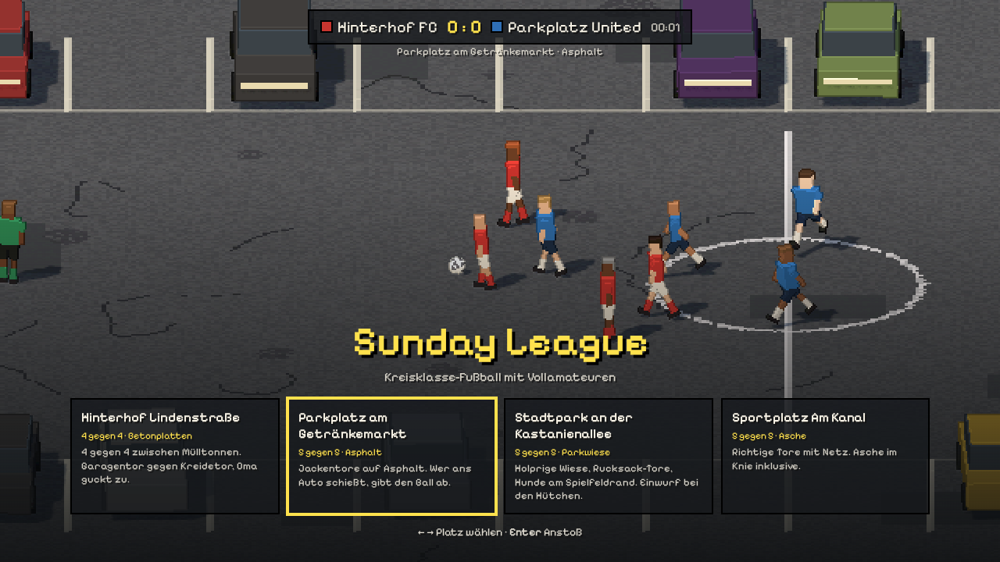
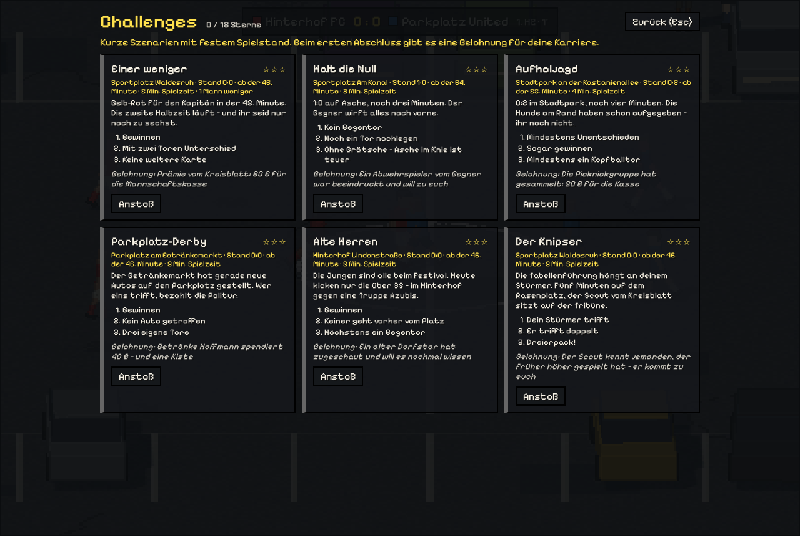

# Sunday League

Kreisklasse-Fußball mit Vollamateuren – vom Parkplatz bis ins Amateurstadion.
Gebaut mit [three.js](https://github.com/mrdoob/three.js) im Stil „3D-Pixelart“ – Seitenansicht, PC-first (Tastatur & Gamepad).



| Hinterhof | Stadtpark | Ascheplatz |
|---|---|---|
|  |  |  |

## Karriere (Saison-Minimalversion)

Im Menü mit **K**: Du übernimmst den SV Sonntagsschuss in der *Freizeitliga Kanalbezirk*
(6 Vereine, Hin- und Rückrunde). Jede Woche fragt die Chatgruppe „Wer kann Sonntag?“ –
Spieler sagen passend zu ihrem Beruf zu oder ab, du kannst dreimal nachhaken. Fehlen Leute,
springt „der Schwager von …“ ein. Den Spieltag spielst du selbst oder simulierst ihn;
die anderen Partien laufen im Hintergrund. Der Spielstand wird im Browser gespeichert.

Fast jede Woche passiert etwas im Verein: Freibier-Abend, Streit in der Gruppe, Kater am Spieltag,
ein Porträt im Kreisblatt oder ein Spieler, der Vater wird. Deine Antwort wirkt sich auf Kasse,
**Teamstimmung** und **Form** der Spieler aus. Gute Stimmung heißt weniger Absagen und leichtere Transfers. Manche Ereignisse sind der Anfang
einer **Lebensgeschichte** über mehrere Wochen: Umzug und Pendeln, Jobverlust, Hochzeit mit
Polterabend, Comeback nach Kreuzbandriss oder das Bruderduell gegen den Ligarivalen.

Auch im Spiel kann etwas passieren: Ein Hund klaut den Ball, der Ball fliegt zum Nachbarn,
ein Autoalarm heult, die Polizei kommt wegen Lärm, ein Gewitter macht den Platz rutschig, der
Rasensprenger springt an, oder der Schiri verletzt sich und ein Zuschauer pfeift weiter.

| Vereinsheim | Kader |
|---|---|
|  |  |

## Challenges

Im Menü mit **C**: sechs Szenarien mit festem Spielstand und Restzeit – „Einer weniger“,
„Halt die Null“, „Aufholjagd“, „Parkplatz-Derby“, „Alte Herren“, „Der Knipser“. Bis zu drei Sterne
je Challenge; beim ersten Abschluss gibt es eine Belohnung für die Karriere (Geld für die Kasse
oder ein neuer Spieler).



## Spielorte

| Platz | Format | Boden | Besonderheit |
|---|---|---|---|
| Hinterhof Lindenstraße | 4 gegen 4 | Betonplatten | Garagentor vs. Kreidetor, Hauswände als Bande |
| Parkplatz am Getränkemarkt | 5 gegen 5 | Asphalt | Jackentore, „Ans Auto“-Regel |
| Stadtpark | 5 gegen 5 | Parkwiese | Rucksack-Tore, Einwurf an der gedachten Linie |
| Sportplatz Am Kanal | 5 gegen 5 | Asche | Jugendtore mit Pfosten & Latte, Ecken, Abstöße |

Design, Featureliste und Roadmap: [ROADMAP.md](ROADMAP.md)

## Starten

```bash
npm install
npm run dev      # Entwicklungsserver auf http://localhost:5173
npm test         # Simulationstests
npm run build    # Produktions-Build nach dist/
```

`?seed=123` in der URL erzeugt reproduzierbar dieselben Teams und denselben Spielverlauf.
`?venue=hinterhof|parkplatz|park|ascheplatz` überspringt die Platzwahl, `?dauer=60` spielt ein Kurzspiel (Sekunden).
`?surface=grass` (bzw. `ash`, `artificial`) spielt den Parkplatz testweise mit anderer Untergrund-Physik.

## Steuerung (Prototyp)

| Aktion | Tastatur | Gamepad |
|---|---|---|
| Laufen | WASD / Pfeiltasten | linker Stick |
| Sprinten | Shift | RB / RT |
| Schuss (halten = Kraft) | Leertaste / K | X / B |
| Pass (Shift + J = hoher Ball / Flanke) | J / E | A |
| Einwurf (Richtung mit Laufen wählen) | J oder Leertaste | A |
| Zweikampf (auf hartem Boden: stochern, sonst Grätsche) | L / Strg | Y |
| Grätsche erzwingen (Schürfwunden-Gefahr!) | Shift + L | RB + Y |
| Spieler wechseln | Q / L | LB |
| Hilfe ein/aus | H | – |
| Auswechseln (beim nächsten Stopp) | U | Back |
| Ton an/aus | N | – |
| Zurück zur Platzwahl | Esc / M | – |
| Spielerpool (im Menü) | P | – |
| Revanche nach Abpfiff | Enter | – |

## Aufbau

```
src/
  core/     Zufall (geseedet), Mathe-Helfer
  data/     Traits, Namen, Berufe, Teams
  sim/      Deterministische Match-Simulation (ohne three.js)
  render/   Pixel-Renderer, Kamera, Parkplatz-Szene, Spieler- & Ballmodelle
  input/    Tastatur & Gamepad
  ui/       HUD
tests/      Vitest-Tests für die Simulation
```
