# Sunday League

**Kreisklasse-Fußball mit Vollamateuren – vom Hinterhof bis zum Rasenplatz.**
Ein Fußball- und Vereinsspiel über die schönste Nebensache der Welt, wie sie wirklich gespielt wird:
Sonntag, 10:30 Uhr, Nieselregen, sieben Zuschauer, zwei davon Hunde.

[](https://github.com/MrPavian/sunday-league/actions/workflows/ci.yml)


> *English:* A cosy amateur-football game in 3D pixel art. Manage a Sunday-league club full of
> dentists, bus drivers and apprentices, play the matches yourself, and live through job stress,
> derbies, pub nights and season trips – across generations. Fully playable in English:
> pick the language on first start or any time in the settings (key **O**).

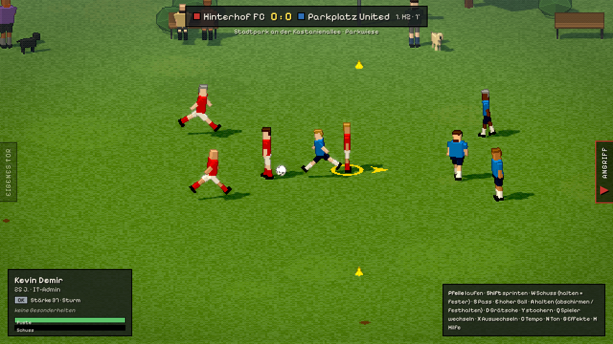

---

## Jetzt spielen

**Im Browser:** <https://mrpavian.github.io/sunday-league/> – auf dem PC mit Tastatur oder Gamepad.
Der Spielstand wird im Browser gespeichert.

**Lokal:**

```bash
git clone https://github.com/MrPavian/sunday-league.git
cd sunday-league
npm install
npm run dev      # http://localhost:5173
```

Voraussetzung: Node.js 20 oder neuer.

---

## Worum geht es?

Du bist **Spielertrainer** beim SV Sonntagsschuss in der Freizeitliga Kanalbezirk. Deine Mannschaft
besteht aus Paketboten, Zahnärzten, Azubis und Frührentnern. Jede Woche fragt die Chatgruppe
„Wer kann Sonntag?“, und die Antworten hängen vom Leben ab: Schichtdienst, krankes Kind, Montage,
Kater vom Polterabend.

Den Spieltag spielst du selbst – in Seitenansicht, mit echtem Ballgefühl, Fehlpässen und Luftlöchern –
oder du lässt ihn simulieren. Dazwischen führst du den Verein: Kasse, Sponsoren, Transfers, Jugend,
Vereinsheim. Und irgendwann knirschen die Knie, und die nächste Generation übernimmt.

**Der Ton:** warmherzig mit trockenem Humor. Das Spiel macht sich nie über seine Figuren lustig –
die Komik entsteht aus dem Alltag.

---

## Features

### Auf dem Platz
- **Selbst spielen oder simulieren** – jede Partie, in der Liga wie im Turnier
- **Sechs Spielorte** mit eigener Physik: Betonplatten, Asphalt, Parkwiese, Asche, Rasen, Hallenparkett
- **Amateurfußball, der sich so anfühlt**: Ausdauer, verspringende Bälle, Schürfwunden auf hartem Boden,
  „Ans Auto“-Regel auf dem Parkplatz
- **Vorfälle im Spiel**: Ein Hund klaut den Ball, der Rasensprenger springt an, die Polizei kommt
  wegen Lärm, der Schiri verletzt sich und ein Zuschauer pfeift weiter
- **Wetter mit Folgen**: Hitze zehrt an der Puste, Regen macht Grätschen lang, Wind verweht Flanken,
  Frost macht den Boden hart, im Schnee bleibt der Ball liegen
- **Derbys** mit Derby-Woche, doppelten Zuschauern und härteren Zweikämpfen
- **Sechs Challenges** mit Sternen und Belohnungen für die Karriere

### Karriere & Verein
- **Wochenrhythmus**: Chatgruppe, Open Training, Stammkneipe, Ereignis, Spieltag
- **Eigener Spielertrainer**: Name, Alter, Beruf, Beziehung, Kinder und Spielertyp selbst festlegen
- **Kasse & Strafenkatalog**: Luftloch 1 €, Eigentor eine Runde für alle
- **Sponsoren mit Eigenarten**: nachverhandeln, bei Laune halten, verlängern – oder verärgern
- **Vereinsheim ausbauen**: warme Duschen, Grill & Theke, Flutlicht, Tribüne – mit Handwerkern oder
  als Arbeitseinsatz mit Überraschungen
- **Transfers, Scouting und Jugend** von der E- bis zur A-Jugend; Talente werden auch abgeworben
- **Turniere**: Stadtmeisterschaft im Sommer, Hallenturnier in der Winterpause
- **Auf- und Abstieg** zwischen Freizeitliga und Kreisklasse

### Leben & Geschichten
- **67 Ereignisse mit 3–10 Ausgängen**, vom Happy End bis zum Vereinsaustritt
- **Lebensgeschichten über Wochen**: Jobverlust, Hochzeit, Comeback nach Kreuzbandriss, Bruderduell
- **Beziehungsnetz**: Kumpels, Schwager, Arbeitskollegen, Rivalen – und der Neue, der früher dein Mobber war
- **Beruf, Schicht, Familie**: Überstunden, Elternzeit, Beförderung, Trennung
- **Verletzungen** in sieben Stufen bis zur seltenen Sportinvalidität, danach ein Amt im Verein
- **Stammkneipe „Zum Anstoß“**: Runden, Einzelgespräche, Taktik auf dem Bierdeckel, Dart gegen Opa Heinz
- **Saisonabschlussfahrt** als Minigeschichte: Kegeltour, Harz oder Mallorca

### Über Generationen
- Ab 40 stellt sich die Frage nach den Schuhen, mit 50 bist du nur noch Trainer
- Mit 60 bis 80 übergibst du das Amt – an **dein Kind**, den Co-Trainer, den Kapitän, eine
  Vereinslegende oder einen neuen Trainer
- **Der Spielstand endet nie**: Die Vereinschronik führt Trainer-Ären, Meisterschaften, Rekordspieler und
  die großen Geschichten

---

## Screenshots

| Hinterhof | Parkplatz | Ascheplatz |
|---|---|---|
| 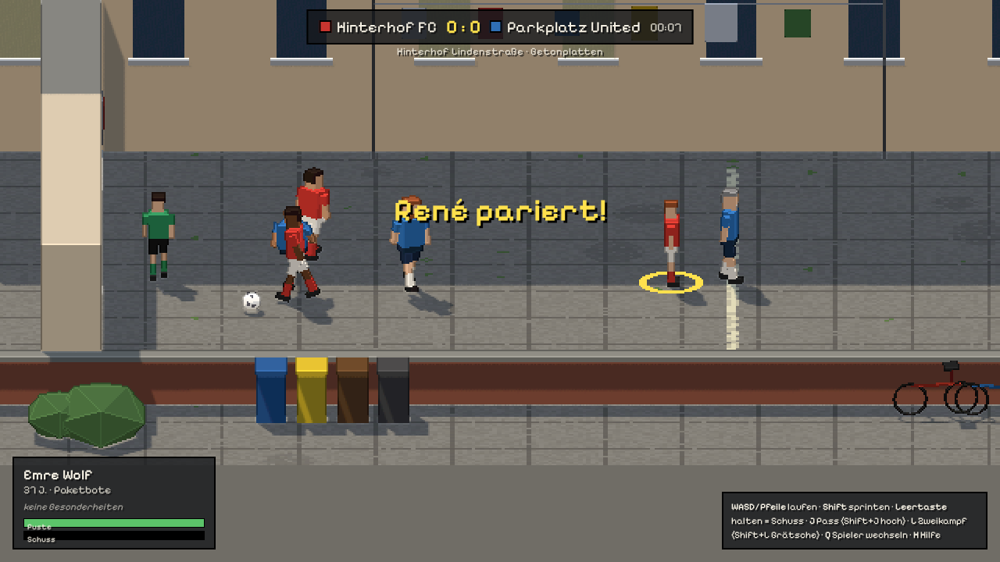 |  | 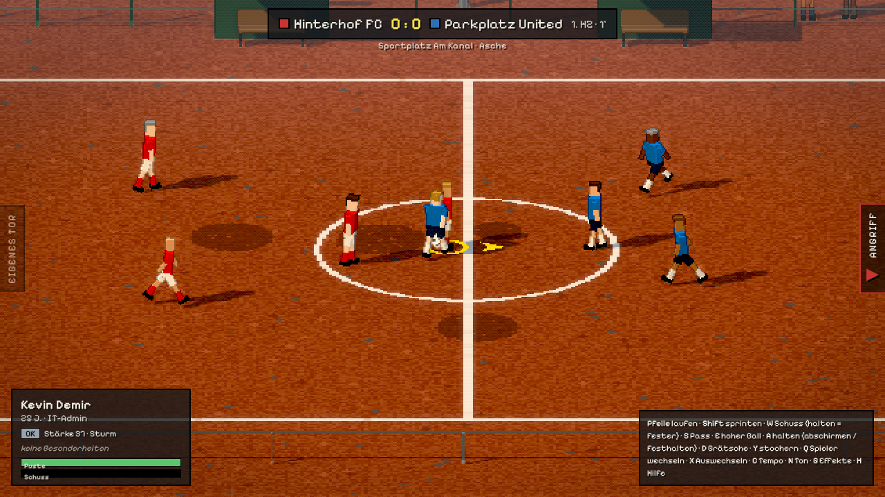 |

| Rasenplatz | Sporthalle | Schnee |
|---|---|---|
| 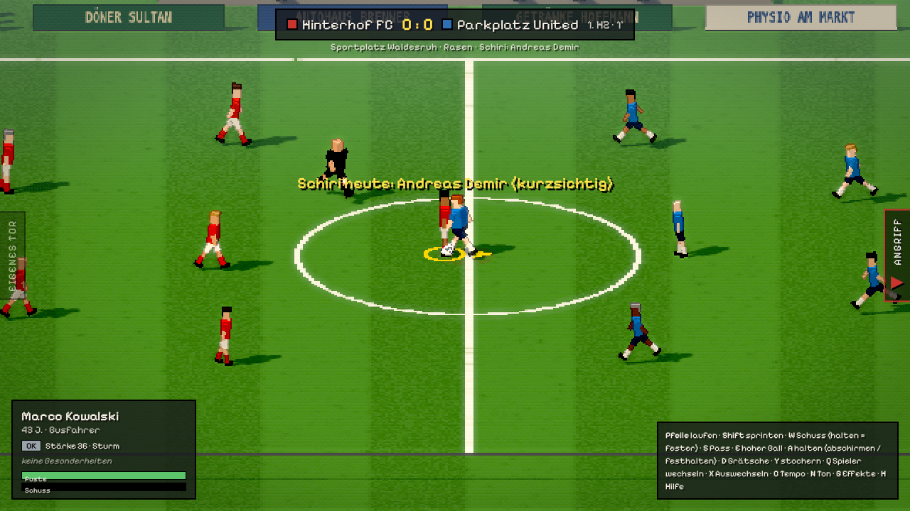 | 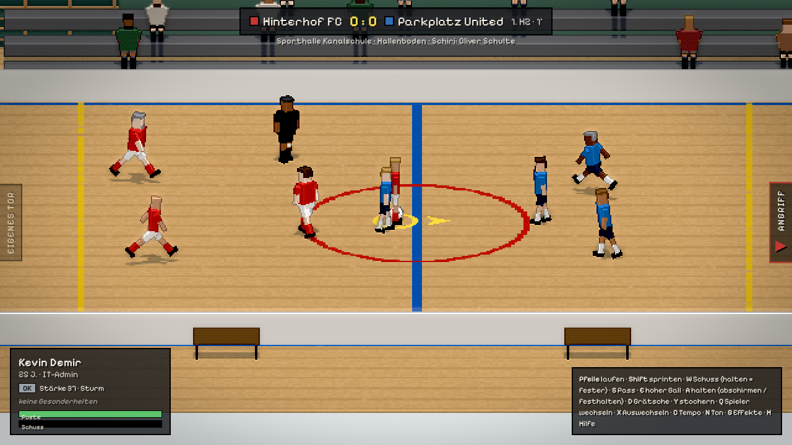 | 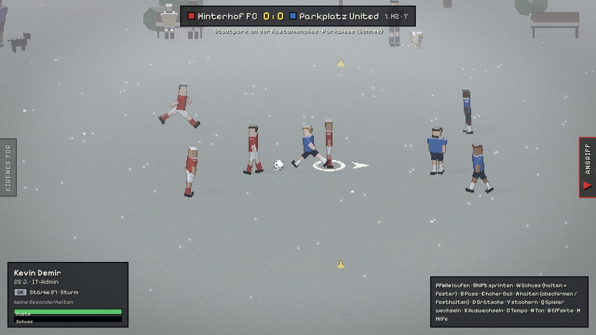 |

| Regen | Nebel |
|---|---|
| 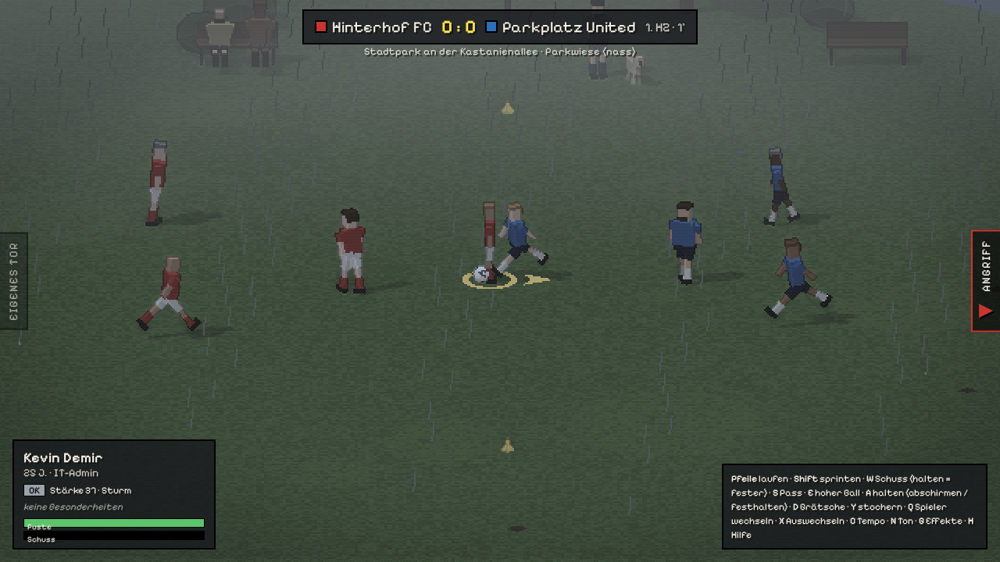 | 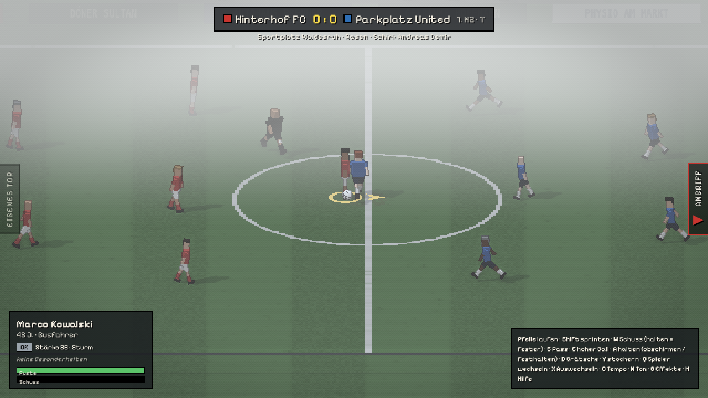 |

| Vereinsheim ausbauen | Sponsoren & Kasse |
|---|---|
| 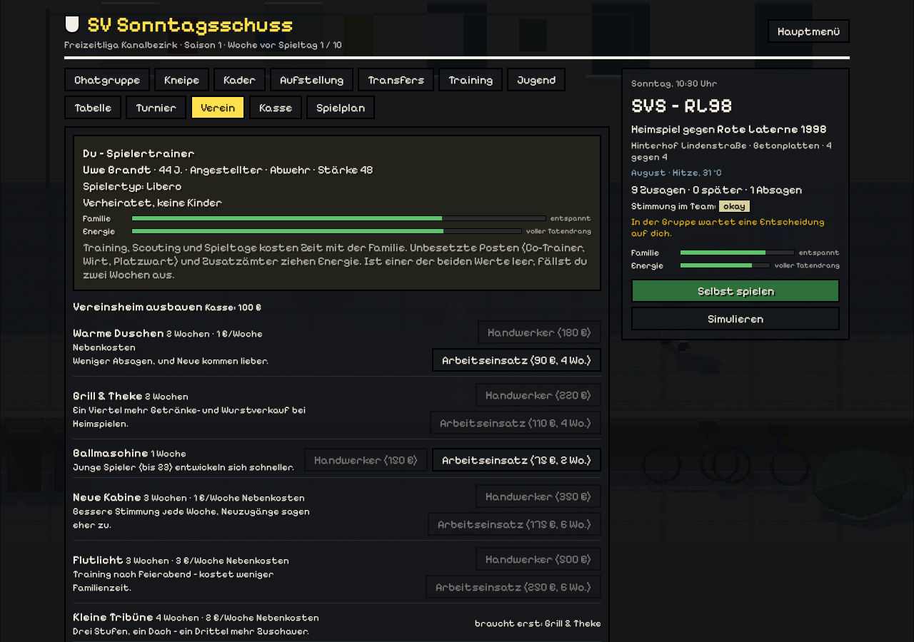 | 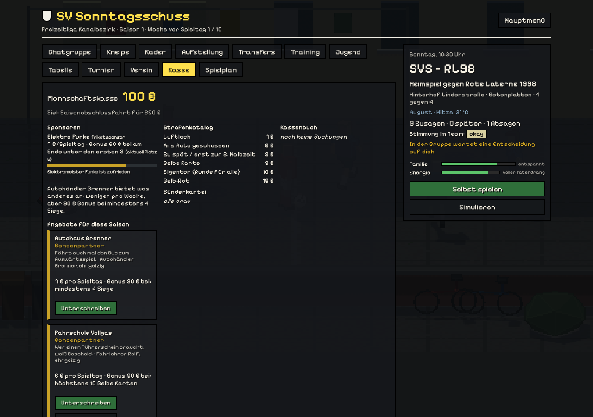 |

| Vereinsheim | Kader |
|---|---|
| 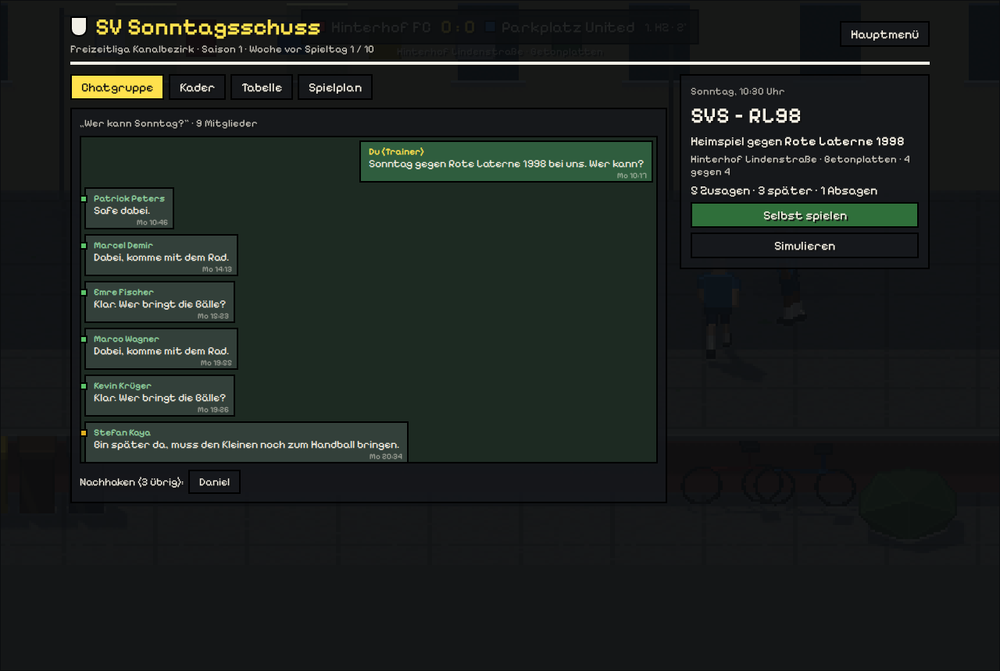 | 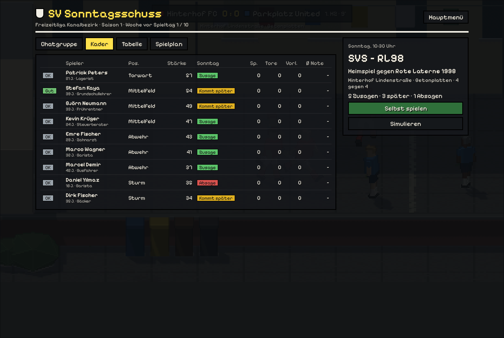 |

| Saisonabschlussfahrt | Nachfolge |
|---|---|
| 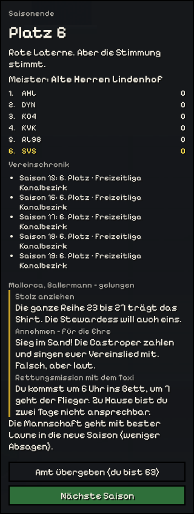 | 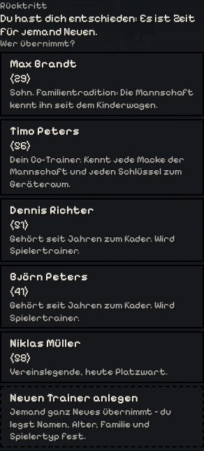 |

---

## Spielorte

| Platz | Format | Boden | Besonderheit |
|---|---|---|---|
| Hinterhof Lindenstraße | 4 gegen 4 | Betonplatten | Garagentor gegen Kreidetor, Hauswände als Bande |
| Parkplatz am Getränkemarkt | 5 gegen 5 | Asphalt | Jackentore, „Ans Auto“-Regel |
| Stadtpark an der Kastanienallee | 5 gegen 5 | Parkwiese | Rucksack-Tore, Einwurf an der gedachten Linie |
| Sportplatz Am Kanal | 5 gegen 5 | Asche | Jugendtore mit Pfosten und Latte, Ecken, Abstöße |
| Sportplatz Waldesruh | 7 gegen 7 | Rasen | Schiri, Banden der lokalen Sponsoren (ab der Kreisklasse) |
| Sporthalle Kanalschule | 5 gegen 5 | Parkett | Bande, Handballtore, Hallenturnier im Winter |

---

## Steuerung

Rechte Hand läuft, linke Hand spielt.

| Aktion | Tastatur | Gamepad |
|---|---|---|
| Laufen | Pfeiltasten | linker Stick |
| Sprinten | Shift | RB / RT |
| Schuss (halten = fester) | W | X |
| Pass flach | S | A |
| Hoher Ball / Flanke | E | B |
| Halten: mit Ball abschirmen, ohne Ball Gegner festhalten (Foulgefahr!) | A | LT |
| Grätsche (auf hartem Boden: Schürfwunden-Gefahr) | D | Y |
| Stochern (Zweikampf im Stehen) | Y | R3 |
| Einwurf (Richtung mit Laufen wählen) | S, E oder W | A |
| Spieler wechseln | Q | LB |
| Auswechseln (beim nächsten Stopp) | X | Back |
| Tempo (ruhig / normal / schnell) | C | – |
| Hilfe ein/aus | H | – |
| Ton an/aus | N | – |
| Grafikeffekte an/aus | G | – |
| Einstellungen (Sprache, Ton, Effekte, Tempo) | O | – |
| Zurück zur Platzwahl | Esc / M | – |

Im Menü: **K** Karriere, **C** Challenges, **P** Spielerpool, **O** Einstellungen.

**Sprache:** Deutsch oder Englisch – Auswahl beim ersten Start und jederzeit in den Einstellungen.
Auf englischen Tastaturen liegt „Stochern“ auf **Z** (gleiche Taste).

---

## Entwicklung

```bash
npm run dev      # Entwicklungsserver mit Hot Reload
npm test         # 133 Tests (Simulation und Karriere)
npm run build    # Produktions-Build nach dist/
npm run preview  # Build lokal ansehen
```

**Testschalter in der URL:**

| Parameter | Wirkung |
|---|---|
| `?seed=123` | Reproduzierbar dieselben Teams und derselbe Spielverlauf |
| `?venue=hinterhof\|parkplatz\|park\|ascheplatz\|rasenplatz\|halle` | Überspringt die Platzwahl |
| `?wetter=regen\|schnee\|nebel\|frost\|wind\|hitze\|laub` | Freundschaftsspiel bei diesem Wetter |
| `?dauer=60` | Kurzspiel mit 60 Sekunden |
| `?surface=grass\|ash\|artificial` | Anderer Untergrund auf dem gewählten Platz |
| `?incident=hund\|gewitter\|autoalarm\|polizei\|zaun` | Löst den Vorfall nach drei Sekunden aus |

### Projektstruktur

```
src/
  core/        Geseedeter Zufall, Mathe-Helfer
  data/        Namen, Berufe, Traits, Vereine, Hintergrundgeschichten
  sim/         Deterministische Match-Simulation (ohne three.js, voll testbar)
  career/      Saison, Verein, Ereignisse, Geschichten, Finanzen, Jugend, Nachfolge …
  challenges/  Challenge-Szenarien
  render/      Pixel-Renderer mit Nachbearbeitungs-Shader, Kamera, Spielorte, Modelle
  audio/       Synthetischer Sound (Web Audio, keine Audiodateien)
  input/       Tastatur und Gamepad
  ui/          Menü, HUD, Vereinsheim, Trainer-Editor
tests/         Vitest-Tests
docs/          Screenshots und Projektüberblick
```

Wie das alles zusammenhängt, steht im **[Projektüberblick](docs/OVERVIEW.md)**.
Game Design, Ideen und Roadmap: **[ROADMAP.md](ROADMAP.md)**.

### Deployment

Jeder Push auf `main` läuft durch die Tests (`.github/workflows/ci.yml`) und wird über GitHub Pages
veröffentlicht (`.github/workflows/pages.yml`). Einmalig im Repository einschalten:
*Settings → Pages → Source: GitHub Actions*.

---

## Stand

Spielbarer Prototyp: Das Match, eine vollständige Karriere mit zwei Ligen und die meisten Vereins- und
Lebenssysteme sind fertig. Das Spiel ist komplett auf Deutsch und Englisch spielbar. Offen sind unter anderem Tutorial, Tastenbelegung,
weitere Ligen und ein Desktop-Build. Details im [Projektüberblick](docs/OVERVIEW.md#8-stand-und-grenzen).

## Mitmachen

Ideen und Fehlerberichte sind als Issue willkommen. Vor einem Pull Request bitte `npm test` und
`npm run build` laufen lassen. Neue Ereignisse folgen dem Muster in `src/career/outcomes.js`: jede Antwort
mit mehreren gewichteten Ausgängen, die passive Antwort zuletzt.

## Lizenz

© 2026 MrPavian – **alle Rechte vorbehalten** (siehe [LICENSE](LICENSE)). Den Code ansehen und das Spiel
spielen ist erlaubt; kopieren, verändern oder weiterverwenden nur mit Erlaubnis. Verwendete Bibliotheken: [three.js](https://github.com/mrdoob/three.js) (MIT) und
die Schrift [Pixelify Sans](https://fonts.google.com/specimen/Pixelify+Sans) (SIL Open Font License 1.1).
Alle Vereine, Personen und Orte sind frei erfunden.
