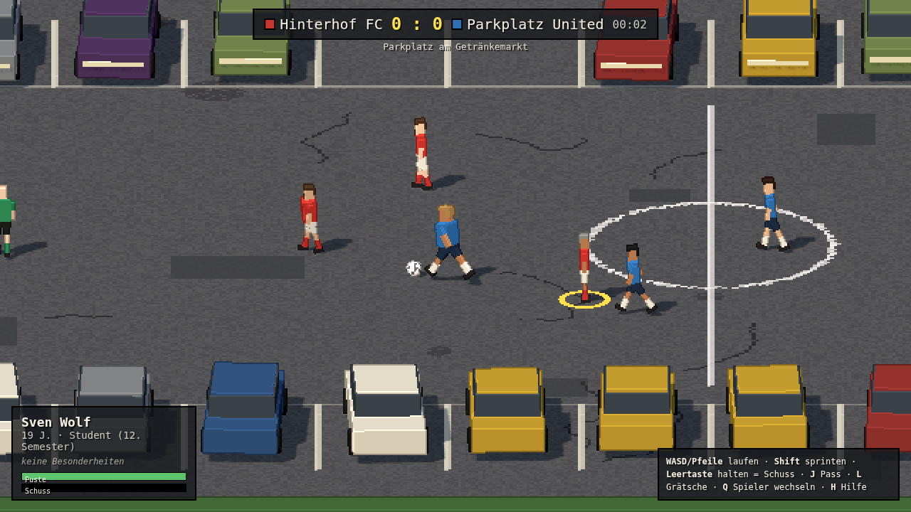

# Sunday League

Kreisklasse-Fußball mit Vollamateuren – vom Parkplatz bis ins Amateurstadion.
Gebaut mit [three.js](https://github.com/mrdoob/three.js) im Stil „3D-Pixelart“ – Seitenansicht, PC-first (Tastatur & Gamepad).



Design, Featureliste und Roadmap: [ROADMAP.md](ROADMAP.md)

## Starten

```bash
npm install
npm run dev      # Entwicklungsserver auf http://localhost:5173
npm test         # Simulationstests
npm run build    # Produktions-Build nach dist/
```

`?seed=123` in der URL erzeugt reproduzierbar dieselben Teams und denselben Spielverlauf.
`?surface=grass` (bzw. `ash`, `artificial`) spielt den Parkplatz testweise mit anderer Untergrund-Physik.

## Steuerung (Prototyp)

| Aktion | Tastatur | Gamepad |
|---|---|---|
| Laufen | WASD / Pfeiltasten | linker Stick |
| Sprinten | Shift | RB / RT |
| Schuss (halten = Kraft) | Leertaste / K | X / B |
| Pass | J / E | A |
| Zweikampf (auf hartem Boden: stochern, sonst Grätsche) | L / Strg | Y |
| Grätsche erzwingen (Schürfwunden-Gefahr!) | Shift + L | RB + Y |
| Spieler wechseln | Q / L | LB |
| Hilfe ein/aus | H | – |
| Revanche nach Abpfiff | Enter | – |

## Aufbau

```
src/
  core/     Zufall (geseedet), Mathe-Helfer
  data/     Traits, Namen, Berufe, Teams
  sim/      Deterministische Match-Simulation (ohne three.js)
  render/   Pixel-Renderer, Kamera, Parkplatz-Szene, Spieler- & Ballmodelle
  input/    Tastatur & Gamepad
  ui/       HUD
tests/      Vitest-Tests für die Simulation
```
