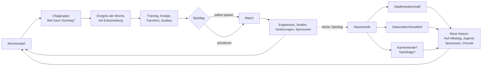
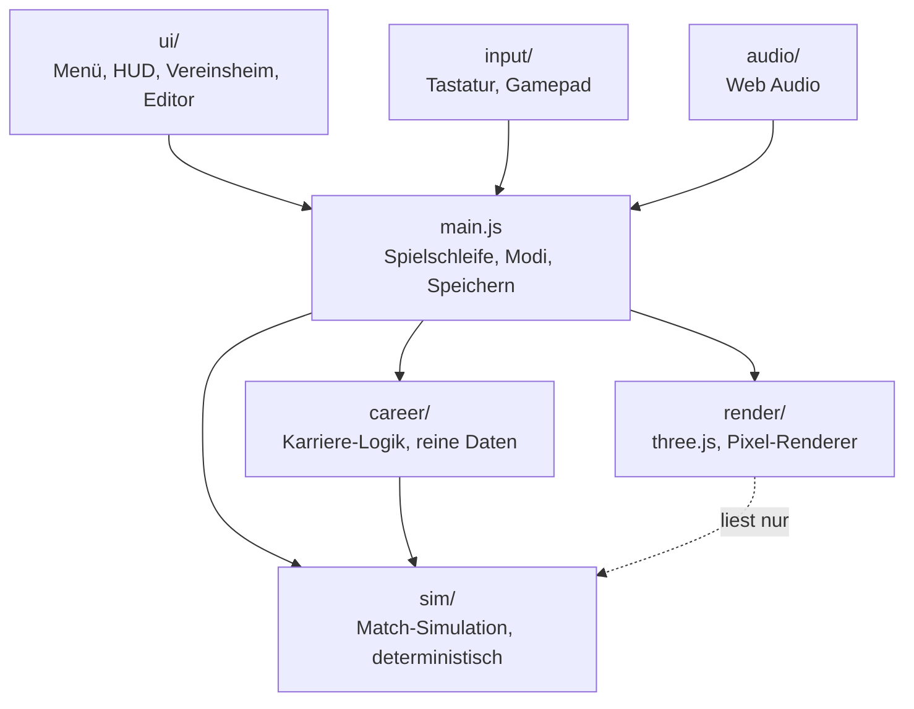

# Sunday League – Projektüberblick

Dieses Dokument erklärt, was Sunday League ist, wie das Spiel aufgebaut ist und wie der Code organisiert ist.
Es richtet sich an alle, die das Projekt kennenlernen, mitentwickeln oder bewerten wollen.
Die ausführliche Ideensammlung und Roadmap steht in [ROADMAP.md](../ROADMAP.md).

**Inhalt**
1. [Kurzfassung](#1-kurzfassung)
2. [Spielkonzept](#2-spielkonzept)
3. [Der Spielablauf](#3-der-spielablauf)
4. [Systeme im Überblick](#4-systeme-im-überblick)
5. [Technische Architektur](#5-technische-architektur)
6. [Grafik](#6-grafik)
7. [Qualität, Tests und Deployment](#7-qualität-tests-und-deployment)
8. [Stand und Grenzen](#8-stand-und-grenzen)
9. [Nächste Schritte](#9-nächste-schritte)
10. [Checkliste vor der Veröffentlichung](#10-checkliste-vor-der-veröffentlichung)

---

## 1. Kurzfassung

| | |
|---|---|
| **Genre** | Fußballspiel mit Vereinsmanagement und Lebenssimulation |
| **Perspektive** | Seitenansicht (TV-Kamera, orthografisch), 3D-Modelle im Pixelart-Look |
| **Plattform** | Browser auf dem PC (Tastatur und Gamepad); Desktop-Build geplant |
| **Technik** | JavaScript (ES-Module), three.js 0.186, Vite 8, Vitest |
| **Sprache** | Deutsch |
| **Umfang** | ca. 14 000 Zeilen Spielcode, 2 200 Zeilen Tests (133 Tests) |
| **Status** | Spielbarer Prototyp mit vollständiger Karriere |

**Die Idee in einem Satz:** Ein Fußballspiel über echten Amateurfußball – Paketboten und Zahnärzte am
Sonntagmorgen, ein Verein, der vom Hinterhof in die Kreisklasse wächst, und ein Spielstand, der über
Generationen weiterläuft.

---

## 2. Spielkonzept

### Design-Säulen

1. **Charmant statt überzeichnet** – keine Superhelden; Stärken und Schwächen sind bodenständig und
   oft liebenswert („Pferdelunge“, „gutes Auge“, „Anführer“).
2. **Das Leben spielt mit** – Job, Familie, Kater und Urlaub bestimmen, wer Sonntag kann.
3. **Wachstum spürbar machen** – Aufstieg, neue Plätze, ein wachsendes Vereinsheim, mehr Zuschauer.
4. **Fußball, der sich amateurhaft anfühlt** – Fehlpässe, verspringende Bälle, Luftlöcher und
   Konditionseinbrüche sind Feature, nicht Bug.
5. **Moderner Pixel-Look** – 3D-Modelle, in niedriger Auflösung gerendert und per Shader nachbearbeitet.

### Ton

Warmherzig mit trockenem Humor. Das Spiel macht sich nie über seine Figuren lustig; die Komik entsteht aus
Alltagssituationen („Der Schaffner drückt ein Auge zu. Das Abteil singt bis Siegen.“). Alle Vereine,
Personen und Orte sind erfunden und spielen in einer fiktiven deutschen Region rund um den Kanalbezirk.

### Zwei Spielhälften

- **Das Match:** echtes Spielen in Echtzeit mit 60-Hz-Simulation – laufen, passen, schießen, grätschen,
  Gegner festhalten. Jede Partie lässt sich auch simulieren.
- **Die Woche:** Vereinsheim als Menü mit Tabs – Chatgruppe, Kneipe, Kader, Aufstellung, Transfers,
  Training, Jugend, Tabelle, Turnier, Verein, Kasse, Spielplan.

---

## 3. Der Spielablauf



**Eine Woche:**
1. Das Wetter wird gewürfelt (Monat nach Spieltag, Saison August bis Mai).
2. Die Chatgruppe füllt sich mit Zu- und Absagen – abhängig von Beruf, Stimmung, Verletzungen, Wetter
   und Vereinsheim. Du kannst dreimal nachhaken.
3. Laufende Geschichten gehen weiter, dann kommt höchstens ein neues Ereignis mit Entscheidung.
4. Du stellst auf, gehst in die Kneipe, richtest ein Open Training aus, baust am Vereinsheim.
5. Spieltag: selbst spielen oder simulieren. Danach Strafen in die Kasse, Verletzungen, Sponsorenlaune,
   Tabelle.

**Saisonende:** Stadtmeisterschaft (optional), Saisonabschlussfahrt als Minigeschichte, Fragen zum
Karriereende. Die neue Saison bringt Auf- oder Abstieg, Entwicklung der Spieler, neue Jugendjahrgänge,
Sponsorenangebote und einen Eintrag in der Chronik.

---

## 4. Systeme im Überblick

| System | Was es tut | Code |
|---|---|---|
| **Match-Simulation** | Spieler, Ball, KI, Zweikämpfe, Fouls, Standards, Untergründe, Vorfälle | `src/sim/` |
| **Spielorte** | Sechs Plätze mit eigener Physik, Regeln und Kulisse | `src/sim/pitch.js`, `src/render/venues/` |
| **Saison & Liga** | Spielplan, Tabelle, zwei Ligen mit Auf- und Abstieg | `src/career/career.js`, `clubs.js` |
| **Chatgruppe** | Zu- und Absagen nach Beruf, Nachhaken, Aushilfen | `career.js`, `chat.js` |
| **Ereignisse** | 67 Ereignisse, jede Antwort mit 3–10 gewichteten Ausgängen | `events.js`, `outcomes.js` |
| **Geschichten** | Mehrwöchige Lebensgeschichten und Vereinsgeschichte, mit Wendungen | `stories.js`, `sagas.js`, `twists.js` |
| **Beziehungen** | Kumpels, Schwager, Kollegen, Rivalen, Feinde; wirkt als Teamchemie im Match | `relations.js`, `social.js` |
| **Spielertrainer** | Eigene Figur mit Familie, Geduld und Energie; Krisen bei Überlastung | `personal.js` |
| **Alltag** | Schicht, Montage, Job-Stress, Kinder, Elternzeit, Trennung | `life.js` |
| **Verletzungen** | Sieben Stufen bis zur Sportinvalidität, danach ein Amt im Verein | `injuries.js` |
| **Kneipe** | Runden, Gespräche mit Spieler-Dossiers, Taktik, Wirt, Dart | `pub.js` |
| **Kasse & Sponsoren** | Beiträge, Strafen, Verkauf; Sponsoren mit Eigenart, Beziehung, Verhandlung | `finances.js`, `sponsors.js` |
| **Vereinsheim** | Sechs Ausbauten mit Bauzeit, Nebenkosten und Wirkung | `facilities.js` |
| **Transfers & Training** | Gerüchte, Scouting, Überzeugen; Open Training mit Stationen | `career.js`, `training.js` |
| **Jugend** | E- bis A-Jugend, Trainingsschwerpunkt, Abwerbung, eigene Kinder | `academy.js`, `youth.js` |
| **Turniere** | Stadtmeisterschaft im Sommer, Hallenturnier im Winter | `tournament.js` |
| **Derbys** | Echter Rivale je Liga, Derby-Woche, Bilanz | `derby.js` |
| **Wetter** | Sieben Wetterlagen nach Jahreszeit, wirkt auf Boden, Ball, Puste, Zuschauer | `weather.js` |
| **Saisonfahrt** | Drei Ziele, je drei Etappen mit Entscheidungen | `trip.js` |
| **Karriereende & Nachfolge** | Schuhe an den Nagel, Amtsübergabe, Trainer-Ären | `legacy.js` |
| **Challenges** | Sechs Szenarien mit Sternen und Karriere-Belohnungen | `src/challenges/` |

---

## 5. Technische Architektur

### Schichten



- **`sim/` kennt kein three.js.** Die Simulation ist reine Logik und läuft in Tests ohne Browser.
- **`render/` liest nur.** Die Darstellung spiegelt den Zustand der Simulation, verändert ihn aber nie.
- **`career/` ist ein JSON-Objekt plus Funktionen.** Der ganze Spielstand ist ein serialisierbares
  Objekt, das im `localStorage` liegt (`sunday-league:career`, versioniert über `SAVE_VERSION`).

### Determinismus

Aller Zufall läuft über einen geseedeten Generator (mulberry32, `src/core/rng.js`). Jede Funktion bekommt
ihren eigenen Zufallsstrom aus Seed, Saison und Spieltag. Folgen:
- Ein Match ist aus seinem Seed exakt reproduzierbar (`?seed=123`).
- Ereignisse lassen sich nicht durch Neuladen „neu würfeln“.
- Tests können ganze Saisons, ja Generationen durchspielen und feste Erwartungen prüfen.

Die Simulation läuft mit festen Schritten von 1/60 Sekunde, unabhängig von der Bildrate. Das Spieltempo
(ruhig / normal / schnell) verlangsamt nur die Uhr, nicht die Physik.

### Das Ereignissystem

Alle Ereignisse folgen demselben Muster:

```js
schiri_beschwerde: {
  weight: 1,                                   // wie oft es gezogen wird
  needs: (c, rng) => ({ ... }) | null,         // passt es gerade? liefert den Kontext
  text: (c, ctx) => '…',                       // die Situation
  options: [
    { label: 'Entschuldigung schreiben', effect: outcome([
        { w: 3, run: (c, ctx) => '…' },        // gewichtete Ausgänge
        { w: (c) => (canLose(c) ? 1 : 0), run: … },  // Gewicht darf vom Zustand abhängen
    ]) },
    { label: 'Passive Antwort', … },           // die letzte Option wählt die Gruppe, wenn du nicht antwortest
  ],
}
```

- `outcome()` würfelt aus mehreren Folgen; Gewichte hängen von Stimmung, Eigenschaften und Kadergröße ab.
- `canLose()` schützt die Mindestkadergröße (sieben Spieler) – niemand verlässt den Verein, wenn dann keine
  Mannschaft mehr übrig ist.
- Geschichten und private Entscheidungen bekommen zusätzlich eine zufällige **Wendung** (`twists.js`).

### Eigene Spieler

Der Spielerpool entsteht deterministisch aus einem festen Seed. Figuren, die es dort nicht gibt – dein
Spielertrainer, deine Kinder, Jugendspieler, Nachfolger – liegen im Spielstand unter `career.custom` mit
Indizes ab 900 000. `playerOf()` rechnet für jeden Spieler Alter und Entwicklung für die aktuelle Saison aus.

---

## 6. Grafik

Die Szene wird in niedriger Auflösung (Höhe ca. 320 Pixel) gerendert und pixelgenau hochskaliert.
Ein Nachbearbeitungs-Shader (`src/render/PixelRenderer.js`) erzeugt daraus den Look:

| Schritt | Wirkung |
|---|---|
| Kanten aus Tiefe und Normalen | Dunkle Silhouetten, helle Innenkanten |
| Kontaktschatten (SSAO light) | Weiche Schatten an Füßen, unter Bänken und Toren |
| Glühen | Helle Flächen strahlen leicht |
| Farbkorrektur | Tönung, Sättigung, Kontrast je Wetter |
| Dunst | Entfernung verblasst – von leichter Luftperspektive bis zu dichtem Nebel |
| Schneedecke und Raureif | Nach oben zeigende Flächen werden weiß |
| Vignette und Bayer-Dithering | Ruhiger Rahmen und Pixelart-Körnung |

Dazu kommen Toon-Shading mit drei Helligkeitsstufen, Schatten der Sonne, ein kühles Gegenlicht und eine
Lichtstimmung pro Wetter. Regen, Schnee und Laub fallen als Partikel. Mit der Taste **G** lassen sich die
teuren Effekte für langsame Rechner abschalten.

---

## 7. Qualität, Tests und Deployment

- **Tests:** 133 Vitest-Tests in `tests/`. Sie prüfen die Match-Physik (Tore, Untergründe, Regeln,
  Standards) und die Karriere: Ereignisse lösen für jede Option auf, Geschichten enden unterschiedlich,
  Sponsoren verlängern, Nachfolge über mehrere Generationen funktioniert.
- **CI:** `.github/workflows/ci.yml` führt bei jedem Push `npm test` und `npm run build` aus.
- **Deployment:** `.github/workflows/pages.yml` baut das Spiel und veröffentlicht es auf GitHub Pages.
- **Keine externen Assets:** Texturen werden per Canvas erzeugt, Geräusche per Web Audio synthetisiert.
  Einzige Laufzeit-Abhängigkeiten sind three.js und die Schrift Pixelify Sans.

---

## 8. Stand und Grenzen

**Fertig und spielbar**
- Match mit sechs Spielorten, Wetter, Vorfällen, Schiri, Auswechslungen, Standards
- Karriere über beliebig viele Saisons mit zwei Ligen, Turnieren und Derbys
- Alle Vereins-, Lebens- und Geschichtensysteme aus der Tabelle oben
- Nachfolge über Generationen
- Sechs Challenges

**Bekannte Grenzen**
- **Nur Deutsch** – alle Texte stehen direkt im Code, ein Übersetzungsgerüst fehlt noch.
- **Zwei Ligen** – über der Kreisklasse C geht es noch nicht weiter.
- **Kein Tutorial, kein Einstellungsmenü** (Tastenbelegung, Lautstärke).
- **Spielstand nur im Browser** – er geht verloren, wenn man die Browserdaten löscht; es gibt keinen Export.
- **Ein Spielstand** gleichzeitig.
- **Große JavaScript-Datei** (knapp 1 MB, gut 280 KB komprimiert) – noch ohne Aufteilung.
- **Grafik** bisher nur mit einem Software-Renderer automatisch getestet; auf schwacher Hardware hilft die Taste G.

---

## 9. Nächste Schritte

Vorschläge in sinnvoller Reihenfolge (Details in [ROADMAP.md](../ROADMAP.md)):

1. **Tutorial als Geschichte** – du ziehst neu in die Stadt, kickst im Hinterhof mit und gründest den Verein.
2. **Einstellungen** – Tasten, Lautstärke, farbenblind-sichere Trikots.
3. **Spielstand exportieren und importieren**, mehrere Speicherplätze.
4. **Übersetzung** – Gerüst für Deutsch und Englisch.
5. **Weitere Ligen und Spielorte** – Kunstrasen, Kleinstadion.
6. **Flutlicht und Abendspiele** – der Ausbau wird auch im Match sichtbar.
7. **Desktop-Build** mit Tauri oder Electron.

---

## 10. Checkliste vor der Veröffentlichung

| Punkt | Stand |
|---|---|
| README mit Screenshots, Steuerung, Schnellstart | erledigt |
| Projektüberblick | dieses Dokument |
| CI grün | ja (Tests und Build) |
| GitHub Pages eingeschaltet | *offen:* Settings → Pages → Source: GitHub Actions |
| Lizenz festlegen und `LICENSE` anlegen | *offen* – z. B. MIT (frei), GPL-3.0 (Änderungen bleiben offen) oder „alle Rechte vorbehalten“ |
| Repository öffentlich schalten | *offen:* Settings → General → Danger Zone → Change visibility |
| Name prüfen | *offen:* „Sunday League“ ist ein Arbeitstitel; vor einer kommerziellen Veröffentlichung auf bestehende Spiele und Marken prüfen |
| Beschreibung und Themen im Repository | *offen:* z. B. `threejs`, `football`, `pixel-art`, `browser-game`, `management-game` |
